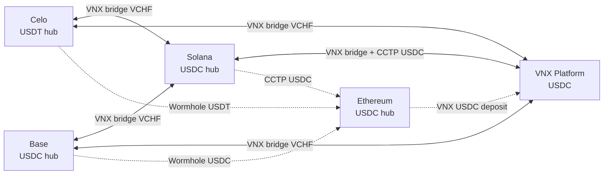

# VCHF Menace — Executive Route Content

> **Purpose:** Structured source for executive route PDFs and stakeholder briefings.  
> **Source of truth:** `src/scanner/routes.py` · `config/chains.yaml` · `config/tokens.yaml`  
> **Matrix reference:** `environment/docs/ROUTES_MATRIX_VCHF.md`  
> **Token:** VCHF · **Platform pair:** `VCHF/USDC`

---

## Dual-hub topology

VCHF Menace runs **10 directed arb routes** across two EVM hubs (Celo + Base), Solana, and the VNX platform. Ethereum is a **settlement hub** (USDC only — no on-chain VCHF pair).



### Hub stables (critical distinction)

| Chain | Hub stable | DEX venue | Notes |
|---|---|---|---|
| **Celo** | **USDT** | CeloSwap (on-chain Uniswap V3) | Only EVM hub on USDT |
| **Base** | **USDC** | KyberSwap aggregator | Native Circle USDC |
| **Solana** | **USDC** | Jupiter | SPL USDC mint |
| **Ethereum** | **USDC** | Uniswap V3 | Settlement only; Wormhole/CCTP landing |
| **VNX** | **USDC** | VNX platform API | No on-chain leg; `VCHF/USDC` pair |

**Rule of thumb:** spend **USDT on Celo**, **USDC on Base/Sol/ETH/VNX**. Cross-hub stable rebalancing uses Wormhole (Celo USDT ↔ ETH) or CCTP (Sol USDC ↔ ETH USDC).

---

## Route groups

| Group | Directions | Active when |
|---|---|---|
| `celo_sol` | `celo_to_solana`, `solana_to_celo` | Always |
| `base_sol` | `base_to_solana`, `solana_to_base` | Always |
| `celo_vnx` | `celo_to_vnx`, `vnx_to_celo` | `ENABLE_VNX_ARB_ROUTES=true` (default) |
| `base_vnx` | `base_to_vnx`, `vnx_to_base` | `ENABLE_VNX_ARB_ROUTES=true` (default) |
| `vnx_sol` | `solana_to_vnx`, `vnx_to_solana` | `ENABLE_VNX_CCTP_ROUTES=true` (default) |

**Arb model:** Buy VCHF on **buy chain**, sell VCHF on **sell chain**. Each leg ends in that chain's hub stable (see `LEG_END_STABLE` in `src/treasury/loops.py`).

---

## All 10 directed routes

### 1. `celo_to_solana` — Celo → Solana

**Group:** `celo_sol` · **Ends with:** Solana USDC

```
Celo USDT ──[CeloSwap]──► Celo VCHF ──[VNX bridge CELO→SOL]──► Sol VCHF ──[Jupiter]──► Sol USDC
                                                                                          │
                                    Wormhole USDT rebalance ◄─────────────────────────────┘
                                    (Celo ↔ Sol probe; treasury normalization)
```

| Leg | Chain | Token in → out | Bridge / venue |
|---|---|---|---|
| 1 | Celo | USDT → VCHF | CeloSwap (on-chain) |
| 2 | Celo → Solana | VCHF → VCHF | **VNX** bridge (deposit CELO, withdraw SOL) |
| 3 | Solana | VCHF → USDC | Jupiter |
| 4 | Reconcile | USDT ↔ USDC | **Wormhole** USDT rebalance probe |

**Min sizes:** 5 VCHF deposit · 30 VCHF platform · 200 VCHF deploy default

---

### 2. `solana_to_celo` — Solana → Celo

**Group:** `celo_sol` · **Ends with:** Celo USDT

```
Sol USDC ──[Jupiter]──► Sol VCHF ──[VNX bridge SOL→CELO]──► Celo VCHF ──[CeloSwap]──► Celo USDT
                                                                                          │
                                    Wormhole USDT rebalance ◄─────────────────────────────┘
```

| Leg | Chain | Token in → out | Bridge / venue |
|---|---|---|---|
| 1 | Solana | USDC → VCHF | Jupiter |
| 2 | Solana → Celo | VCHF → VCHF | **VNX** bridge (deposit SOL, withdraw CELO) |
| 3 | Celo | VCHF → USDT | CeloSwap (on-chain) |
| 4 | Reconcile | USDT ↔ USDC | **Wormhole** USDT rebalance probe |

**Min sizes:** 5 VCHF deposit · 30 VCHF platform · 200 VCHF deploy default

---

### 3. `base_to_solana` — Base → Solana

**Group:** `base_sol` · **Ends with:** Solana USDC

```
Base USDC ──[KyberSwap]──► Base VCHF ──[VNX bridge BASE→SOL]──► Sol VCHF ──[Jupiter]──► Sol USDC
                                                                                            │
                                      Wormhole USDC rebalance ◄─────────────────────────────┘
                                      (Base ↔ Sol probe)
```

| Leg | Chain | Token in → out | Bridge / venue |
|---|---|---|---|
| 1 | Base | USDC → VCHF | KyberSwap aggregator |
| 2 | Base → Solana | VCHF → VCHF | **VNX** bridge (deposit BASE, withdraw SOL) |
| 3 | Solana | VCHF → USDC | Jupiter |
| 4 | Reconcile | USDC ↔ USDC | **Wormhole** USDC rebalance probe |

**Min sizes:** 5 VCHF deposit · 30 VCHF platform · 200 VCHF deploy default

---

### 4. `solana_to_base` — Solana → Base

**Group:** `base_sol` · **Ends with:** Base USDC

```
Sol USDC ──[Jupiter]──► Sol VCHF ──[VNX bridge SOL→BASE]──► Base VCHF ──[KyberSwap]──► Base USDC
                                                                                          │
                                    Wormhole USDC rebalance ◄─────────────────────────────┘
```

| Leg | Chain | Token in → out | Bridge / venue |
|---|---|---|---|
| 1 | Solana | USDC → VCHF | Jupiter |
| 2 | Solana → Base | VCHF → VCHF | **VNX** bridge (deposit SOL, withdraw BASE) |
| 3 | Base | VCHF → USDC | KyberSwap aggregator |
| 4 | Reconcile | USDC ↔ USDC | **Wormhole** USDC rebalance probe |

**Min sizes:** 5 VCHF deposit · 30 VCHF platform · 200 VCHF deploy default

---

### 5. `celo_to_vnx` — Celo → VNX Platform

**Group:** `celo_vnx` · **Ends with:** VNX USDC

```
Celo USDT ──[CeloSwap]──► Celo VCHF ──[VNX deposit-only CELO]──► Platform VCHF ──[VNX API sell]──► Platform USDC
                                                                                                      │
                         Hub return (closed loop): Wormhole Celo USDT → ETH → Uniswap → VNX ETH USDC ◄┘
```

| Leg | Chain | Token in → out | Bridge / venue |
|---|---|---|---|
| 1 | Celo | USDT → VCHF | CeloSwap (on-chain) |
| 2 | Celo → VNX | VCHF → VCHF | **VNX** deposit-only (min 5 VCHF cumulative) |
| 3 | VNX | VCHF → USDC | Platform sell (`VCHF/USDC`, min 30 VCHF) |
| 4 | Hub (return) | USDT → USDC | **Wormhole** Celo→ETH + Uniswap USDT→USDC + **VNX** ETH USDC deposit |

**Min sizes:** 5 VCHF CELO deposit · 30 VCHF sell · 200 VCHF deploy default

---

### 6. `vnx_to_celo` — VNX Platform → Celo

**Group:** `celo_vnx` · **Ends with:** Celo USDT

```
Platform USDC ──[VNX API buy]──► Platform VCHF ──[VNX withdraw CELO]──► Celo VCHF ──[CeloSwap]──► Celo USDT
```

| Leg | Chain | Token in → out | Bridge / venue |
|---|---|---|---|
| 1 | VNX | USDC → VCHF | Platform buy (min 30 VCHF) |
| 2 | VNX → Celo | VCHF → VCHF | **VNX** withdraw-only to Celo hot wallet |
| 3 | Celo | VCHF → USDT | CeloSwap (on-chain) |

**Min sizes:** 30 VCHF buy · 5 VCHF withdraw credit · 200 VCHF deploy default

---

### 7. `base_to_vnx` — Base → VNX Platform

**Group:** `base_vnx` · **Ends with:** VNX USDC

```
Base USDC ──[KyberSwap]──► Base VCHF ──[VNX deposit-only BASE]──► Platform VCHF ──[VNX API sell]──► Platform USDC
                                                                                                      │
                         Hub return: Wormhole Base USDC → ETH + VNX ETH USDC deposit (`base_usdc_to_vnx_usdc`) ◄┘
```

| Leg | Chain | Token in → out | Bridge / venue |
|---|---|---|---|
| 1 | Base | USDC → VCHF | KyberSwap aggregator |
| 2 | Base → VNX | VCHF → VCHF | **VNX** deposit-only (min 5 VCHF cumulative) |
| 3 | VNX | VCHF → USDC | Platform sell (`VCHF/USDC`, min 30 VCHF) |
| 4 | Hub (return) | USDC → USDC | **Wormhole** Base→ETH + **VNX** ETH USDC deposit |

**Min sizes:** 5 VCHF BASE deposit · 30 VCHF sell · 200 VCHF deploy default

---

### 8. `vnx_to_base` — VNX Platform → Base

**Group:** `base_vnx` · **Ends with:** Base USDC

```
Platform USDC ──[VNX API buy]──► Platform VCHF ──[VNX withdraw BASE]──► Base VCHF ──[KyberSwap]──► Base USDC
```

| Leg | Chain | Token in → out | Bridge / venue |
|---|---|---|---|
| 1 | VNX | USDC → VCHF | Platform buy (min 30 VCHF) |
| 2 | VNX → Base | VCHF → VCHF | **VNX** withdraw-only to Base hot wallet |
| 3 | Base | VCHF → USDC | KyberSwap aggregator |

**Min sizes:** 30 VCHF buy · 5 VCHF withdraw credit · 200 VCHF deploy default

---

### 9. `solana_to_vnx` — Solana → VNX Platform

**Group:** `vnx_sol` · **Ends with:** VNX USDC

```
Sol USDC ──[Jupiter]──► Sol VCHF ──[VNX deposit-only SOL]──► Platform VCHF ──[VNX API sell]──► Platform USDC
                                                                                                  │
                                              CCTP reconcile (Sol USDC ↔ ETH USDC) ◄──────────────┘
```

| Leg | Chain | Token in → out | Bridge / venue |
|---|---|---|---|
| 1 | Solana | USDC → VCHF | Jupiter |
| 2 | Solana → VNX | VCHF → VCHF | **VNX** deposit-only (min 5 VCHF cumulative) |
| 3 | VNX | VCHF → USDC | Platform sell (`VCHF/USDC`, min 30 VCHF) |
| 4 | Reconcile | USDC → USDC | **CCTP** Sol→ETH probe (treasury normalization) |

**Min sizes:** 5 VCHF SOL deposit · 30 VCHF sell · 200 VCHF deploy default

---

### 10. `vnx_to_solana` — VNX Platform → Solana

**Group:** `vnx_sol` · **Ends with:** Solana USDC

```
Platform USDC ──[VNX API buy]──► Platform VCHF ──[VNX withdraw SOL]──► Sol VCHF ──[Jupiter]──► Sol USDC
                                                                                                  │
                         Closed-loop return: CCTP Sol USDC → ETH → VNX USDC → buy VCHF (`cctp_sol_usdc_to_vnx`) ◄┘
```

| Leg | Chain | Token in → out | Bridge / venue |
|---|---|---|---|
| 1 | VNX | USDC → VCHF | Platform buy (min 30 VCHF) |
| 2 | VNX → Solana | VCHF → VCHF | **VNX** withdraw-only to Sol hot wallet |
| 3 | Solana | VCHF → USDC | Jupiter |
| 4 | Return (if origin=VNX) | USDC → VCHF | **CCTP** Sol→ETH + **VNX** ETH USDC deposit + platform buy |

**Min sizes:** 30 VCHF buy · 5 VCHF withdraw credit · 200 VCHF deploy default

---

## Auxiliary path (not a directed pair)

### `cctp_sol_usdc_to_vnx` — Solana → VNX (treasury return)

Used after `vnx_to_solana` when round-trip origin is the VNX platform (`use_cctp_usdc_return()`).

```
Sol USDC ──[CCTP burn]──► ETH USDC ──[VNX ETH deposit]──► Platform USDC ──[VNX API buy]──► Platform VCHF
```

| Leg | Chain | Token in → out | Bridge / venue |
|---|---|---|---|
| 1 | Solana → Ethereum | USDC → USDC | **Circle CCTP** v2 |
| 2 | Ethereum → VNX | USDC → USDC | **VNX** ETH USDC deposit (min 20 USDC cumulative) |
| 3 | VNX | USDC → VCHF | Platform buy (min 30 VCHF) |

---

## Compact route matrix

| # | Direction | Buy chain → Sell chain | Hub spent | Hub received | VCHF bridge | Stable rebalance |
|---|---|---|---|---|---|---|
| 1 | `celo_to_solana` | Celo → Solana | Celo **USDT** | Sol **USDC** | VNX CELO→SOL | Wormhole USDT |
| 2 | `solana_to_celo` | Solana → Celo | Sol **USDC** | Celo **USDT** | VNX SOL→CELO | Wormhole USDT |
| 3 | `base_to_solana` | Base → Solana | Base **USDC** | Sol **USDC** | VNX BASE→SOL | Wormhole USDC |
| 4 | `solana_to_base` | Solana → Base | Sol **USDC** | Base **USDC** | VNX SOL→BASE | Wormhole USDC |
| 5 | `celo_to_vnx` | Celo → VNX | Celo **USDT** | VNX **USDC** | VNX deposit | Wormhole Celo→ETH hub |
| 6 | `vnx_to_celo` | VNX → Celo | VNX **USDC** | Celo **USDT** | VNX withdraw | — |
| 7 | `base_to_vnx` | Base → VNX | Base **USDC** | VNX **USDC** | VNX deposit | Wormhole Base→ETH hub |
| 8 | `vnx_to_base` | VNX → Base | VNX **USDC** | Base **USDC** | VNX withdraw | — |
| 9 | `solana_to_vnx` | Solana → VNX | Sol **USDC** | VNX **USDC** | VNX deposit | CCTP reconcile |
| 10 | `vnx_to_solana` | VNX → Solana | VNX **USDC** | Sol **USDC** | VNX withdraw | CCTP return |

---

## Minimum sizes reference

| Guard | Value | Env / constant |
|---|---|---|
| On-chain VCHF deposit (CELO, BASE, SOL) | **5 VCHF** cumulative | `VNX_MIN_DEPOSIT_VCHF_CELO`, `_BASE`, `_SOL` |
| ETH USDC deposit credit | **20 USDC** cumulative | `VNX_MIN_DEPOSIT_USDC_ETH` |
| Platform buy/sell order | **30 VCHF** | `VCHF_MIN_ORDER` in `src/vnx/trading.py` |
| Deploy trade sizing | **200 VCHF** default | `MIN_TRADE_VCHF` |
| Route-matrix test probe | **31 VCHF** | `TEST_VCHF` in `scripts/execute_route_matrix.py` |

---

## VCHF token addresses

| Chain | Contract / mint |
|---|---|
| Celo | `0xc5ebea9984c485ec5d58ca5a2d376620d93af871` |
| Base | `0x1fca74d9ef54a6ac80ffe7d3b14e76c4330fd5d8` |
| Solana | `AhhdRu5YZdjVkKR3wbnUDaymVQL2ucjMQ63sZ3LFHsch` |
| VNX | `VCHF` (platform symbol) |

---

## Operational notes

- **Dual hub:** Celo (USDT) and Base (USDC) are peer EVM hubs; Solana is the third on-chain venue. No direct Celo↔Base VCHF route — cross via Sol or VNX.
- **VNX ETH = USDC only:** Platform settlement on Ethereum uses USDC deposits/withdrawals; no on-chain VCHF on ETH.
- **Shared VNX account:** Collides with GBP Menace on the same platform keys — set `VNX_COLLISION_RETRY_MAX=3`, `VNX_COLLISION_BACKOFF_SEC=5`.
- **Deploy default:** `DRY_RUN=true` until validation matrix passes (`scripts/run_validation_matrix.py`).
- **Core arb legs (8):** All groups except none disabled by default — full 10 active when both `ENABLE_VNX_ARB_ROUTES` and `ENABLE_VNX_CCTP_ROUTES` are true.

---

## Related

- Route matrix (shared): [`environment/docs/ROUTES_MATRIX_VCHF.md`](../../docs/ROUTES_MATRIX_VCHF.md)
- Bot repo: [vchf_menace](https://github.com/Giansensey007/vchf_menace)
- PDF generator: `scripts/generate_routes_pdf.py`
